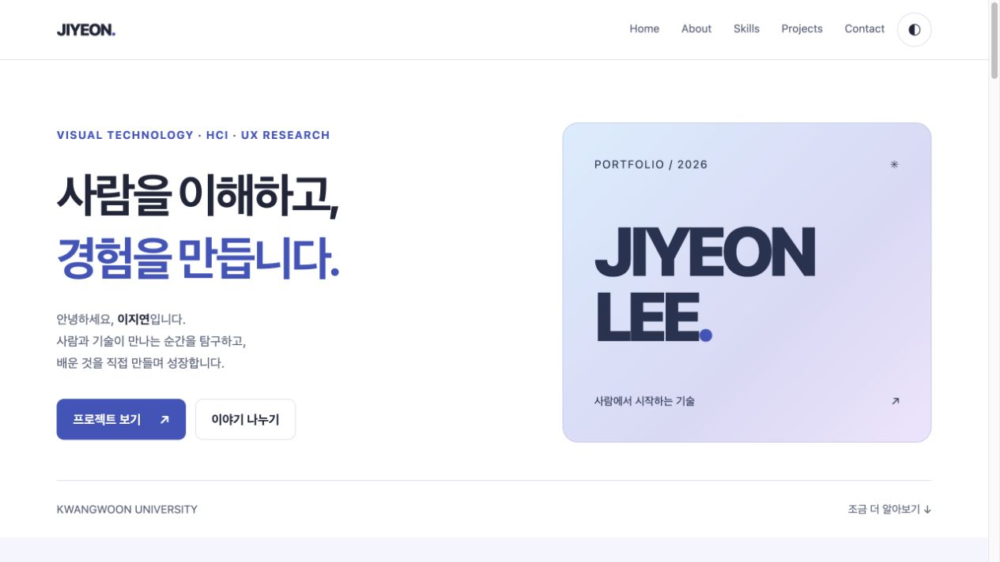
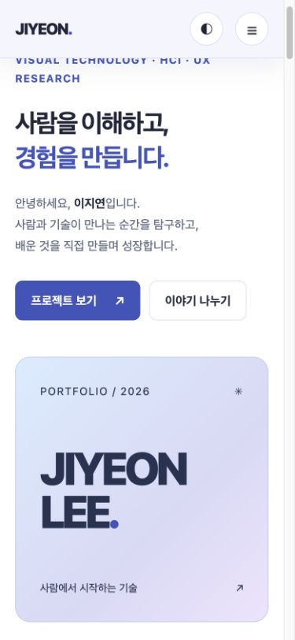
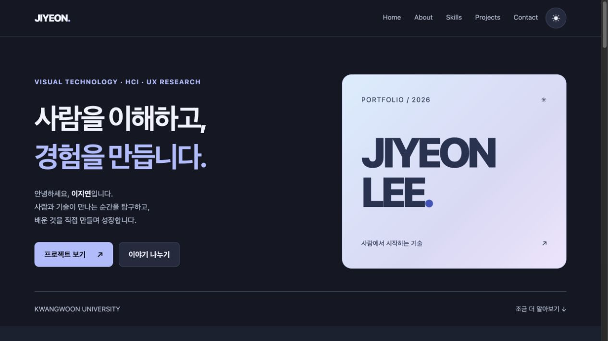

# JIYEON LEE · Portfolio

자기소개와 관심 분야, 기술 스택을 소개하고 GitHub API를 통해 공개 프로젝트를 보여 줍니다.

외부 라이브러리 없이 HTML, CSS, JavaScript로 구현했으며, **사용자 이벤트 → 상태 변경 → DOM 업데이트**를 중심으로 구성했습니다.

[배포 사이트](https://bborang.github.io/codyssey-B1-1/) · [GitHub 저장소](https://github.com/bborang/codyssey-B1-1)

## 주요 기능

| 영역 | 기능 |
| --- | --- |
| Hero · About | 소개, 관심 분야, 활동 및 수상 이력, 프로필 이미지 |
| Skills | 언어, 프론트엔드, 데이터, 인프라 및 디자인 도구 소개 |
| Projects | GitHub 공개 저장소 조회, 프로젝트 카드, 로딩·오류·빈 상태 및 재시도 |
| Contact | 이름·이메일·메시지 검증, 필드별 오류 및 입력 확인 메시지 |
| Navigation | 모바일 메뉴, 앵커 이동, 스크롤에 따른 헤더 스타일 변경 |
| Theme · Motion | 다크 모드와 설정 저장, 등장 애니메이션, 맨 위로 이동 |
| Footer | 저작권 표시, GitHub·LinkedIn 링크 |

문의 폼은 입력 검증용이며 실제 이메일을 전송하지 않습니다. 연락은 페이지의 이메일 링크를 이용할 수 있습니다.

## 기술 스택

- **HTML5:** 시맨틱 마크업과 접근성 속성
- **CSS3:** CSS 변수, Flexbox, Grid, 미디어 쿼리, transition
- **JavaScript ES6+:** DOM API, 이벤트, 구조분해 할당, 배열 메서드, async/await
- **Web APIs:** Fetch, Local Storage, Intersection Observer, AbortController
- **배포:** GitHub Pages

별도 패키지 설치나 빌드 과정이 없습니다. 페이지의 Skills에 소개된 React·Tailwind CSS 등은 개인 기술 소개이며 이 프로젝트의 구현에는 사용하지 않았습니다.

## 프로젝트 구조

```text
.
├── index.html               # 페이지 구조와 콘텐츠
├── css/
│   └── style.css            # 테마, 레이아웃, 반응형 스타일
├── js/
│   └── main.js              # 인터랙션, API 요청, 폼 검증
├── images/
│   ├── profile.svg          # 이니셜 프로필 이미지
│   └── screenshots/         # 데스크톱·모바일·다크 모드 화면
├── .vscode/
│   └── extensions.json      # Live Server 확장 추천
├── .gitignore
└── README.md
```

## 핵심 구현

### 시맨틱 구조와 접근성

`header`, `nav`, `main`, `section`, `article`, `footer`로 콘텐츠의 역할을 구분했습니다. 이미지에는 의미 있는 `alt`를 제공하고, 폼의 `label`과 입력 요소를 `for`·`id`로 연결했습니다. 본문 바로가기, 키보드 포커스 표시, 메뉴의 `aria-expanded`, 오류 필드의 `aria-invalid`를 적용했습니다.

### 모바일 퍼스트 레이아웃

작은 화면의 한 열 배치를 기본으로 작성하고 **768px**과 **1024px**에서 레이아웃을 확장했습니다. 네비게이션과 버튼 정렬에는 Flexbox, 카드 배치에는 Grid를 사용합니다.

Projects는 `repeat(auto-fit, minmax(min(100%, 280px), 1fr))`로 화면 너비에 맞춰 열 수를 조정합니다. 색상·폰트·간격은 CSS 변수로 관리하고 `[data-theme="dark"]`에서 테마 색상을 재정의합니다.

### 이벤트와 상태 관리

`querySelector`와 `querySelectorAll`로 DOM을 선택하고 `addEventListener`로 이벤트를 연결합니다. 상태 변경과 렌더링 함수를 분리해 화면이 현재 상태를 반영하도록 구성했습니다.

| 기능 | 이벤트·처리 | 상태 | 렌더링 |
| --- | --- | --- | --- |
| 모바일 메뉴 | 버튼 click | menuOpen | active 클래스와 버튼 속성 변경 |
| 다크 모드 | 버튼 click | theme | data-theme 및 버튼 표시 변경 |
| 스크롤 | window scroll | scrolled · showTopButton | 헤더 스타일과 맨 위 버튼 표시 |
| 프로젝트 | API 요청·응답 | loading · success · empty · error | 상태 메시지와 프로젝트 카드 |
| 문의 폼 | input · submit | errors · success | 필드별 오류와 입력 확인 메시지 |

모바일 메뉴는 링크 선택, Escape, 바깥 클릭 시 닫힙니다. 테마는 Local Storage에 저장해 새로고침 후 복원하며, 저장소 접근이 제한되어도 현재 화면의 전환은 유지됩니다.

### GitHub API 연동

```text
GET https://api.github.com/users/bborang/repos?sort=updated&per_page=100
```

공개 저장소를 수정일 순서로 최대 100개 조회합니다. `fetch`와 `async/await`로 요청하고, `response.ok` 검사와 `try/catch`로 HTTP 오류 및 네트워크 실패를 처리합니다. 15초 동안 응답이 없으면 요청을 중단하고 재시도를 안내합니다.

응답 객체를 구조분해한 뒤 `map`과 템플릿 리터럴로 카드 HTML을 생성합니다. 외부 텍스트는 이스케이프하여 삽입하고, 링크는 고정된 GitHub 주소와 인코딩된 저장소 이름으로 구성합니다.

| 요청 상태 | 표시 내용 |
| --- | --- |
| 로딩 | 프로젝트를 불러오는 중이라는 안내 |
| 성공 | 저장소 이름, 설명, 언어, 스타 수, 링크 |
| 빈 목록 | 표시할 프로젝트가 없다는 안내 |
| 실패 | 오류 안내와 재시도 버튼 |

인증 없는 요청의 호출 제한을 고려해 중복 로딩을 막고, 403·429 응답에는 요청 제한 안내를 표시합니다.

### 폼 유효성 검사

이름·이메일·메시지의 빈 값과 공백 입력, 이메일 형식을 검사합니다. `input` 이벤트에서 필드별 오류를 갱신하고, `submit` 이벤트에서는 `preventDefault()`로 기본 제출을 막은 뒤 전체 입력을 검사합니다. 오류가 있으면 첫 번째 오류 필드로 포커스를 이동하며, 정상 입력 후 값을 수정하면 성공 메시지를 지웁니다.

### 스크롤 인터랙션

| 항목 | 기준 및 동작 |
| --- | --- |
| 헤더 변경 | 스크롤 60px 이상에서 배경과 그림자 변경 |
| 맨 위 버튼 | 스크롤 300px 이상에서 표시 |
| 등장 애니메이션 | Intersection Observer threshold 0.2, 한 번 표시 후 관찰 해제 |
| 앵커 이동 | CSS scroll-behavior와 scroll-margin-top 적용 |
| 모션 감소 | prefers-reduced-motion 설정 시 애니메이션·부드러운 이동 생략 |

## 화면

### 데스크톱



### 모바일



### 다크 모드


